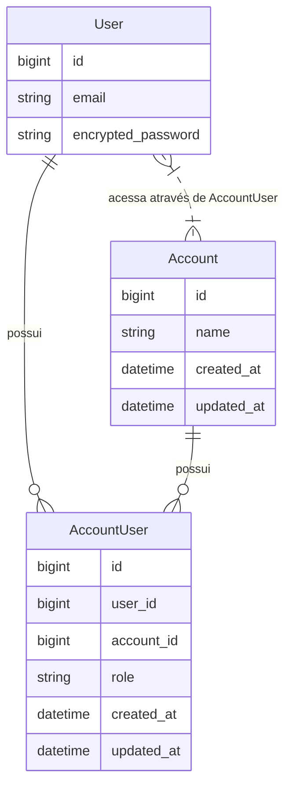

# 📋 Plano de Implementação: FASE 2 — Autenticação, Multi-Tenancy & Seleção de Ambiente

Este documento descreve a estratégia técnica e de implementação para a **FASE 2** do sistema **Petunia**. O objetivo principal é introduzir a estrutura de **Multi-Tenancy por Conta (`Account`)**, permitindo que cada usuário gerencie múltiplos ambientes financeiros (ex: *Conta Pessoal*, *Conta Família*, *Projetos*) com alternância rápida e isolamento de dados.

---

## 🎯 Descrição do Objetivo

1. **Modelagem de Dados e Associações**:
   - Criar as entidades `Account` (Ambiente financeiro) e `AccountUser` (Tabela pivô de relacionamento N:N entre `User` e `Account` com papel/função `role`).
   - Atualizar a entidade `User` com associações `has_many :account_users` e `has_many :accounts, through: :account_users`.
   - Garantir que todo novo registro de `User` crie automaticamente uma `Account` inicial (ex: "Conta Pessoal") com papel `owner`.

2. **Gerenciamento de Ambiente Ativo (`current_account`)**:
   - Implementar helper e lógica no `ApplicationController` para rastrear o ambiente ativo atual armazenado na sessão (`session[:current_account_id]`).
   - Tratar cenários onde a sessão está vazia ou a conta selecionada não pertence mais ao usuário (fallback automático para a primeira conta).

3. **Seletor de Ambiente e Gerenciamento de Contas (`AccountsController` & UI)**:
   - Criar rotas e ações para listar contas, criar nova conta e trocar a conta ativa (`switch`).
   - Adicionar dropdown/seletor de ambiente ativo no header da aplicação (`shared/_header.html.erb`) no padrão visual *Obsidian Dark*.

4. **Internacionalização (i18n)** e **Testes Automatizados (RSpec em PT-BR)**:
   - Adicionar todas as mensagens e labels em `config/locales/pt-BR.yml` e `config/locales/en.yml`.
   - Escrever testes RSpec unitários e de integração garantindo 100% de cobertura nos relacionamentos, criação automática de conta e alternância de ambientes.

---

## ⚠️ User Review Required

> [!IMPORTANT]
> **Criação Automática de Conta Inicial**: Todo usuário que se cadastrar receberá automaticamente uma conta com o nome padrão **"Conta Pessoal"** atribuindo-lhe a role `"owner"`.

> [!NOTE]
> **Permissões e Roles**: Na Fase 2, o campo `role` em `AccountUser` será armazenado como string com valor padrão `"owner"` (proprietário) ou `"member"` (membro). A matriz fina de permissões avançadas pode ser expandida em fases futuras conforme a evolução do sistema.

---

## ❓ Perguntas Abertas

Não há perguntas impeditivas no momento. Todas as regras seguem estritamente as definições contidas em `.agents/roadmap.md` e `.agents/description.md`.

---

## 🛠️ Alterações Propostas



---

### Componente 1: Banco de Dados & Models

#### [NEW] `db/migrate/TIMESTAMP_create_accounts.rb`
Tabela para os ambientes/workspaces de controle financeiro:
- `name` (string, null: false)

#### [NEW] `db/migrate/TIMESTAMP_create_account_users.rb`
Tabela pivô com índice único no par `[user_id, account_id]`:
- `user_id` (references, null: false, foreign_key: true)
- `account_id` (references, null: false, foreign_key: true)
- `role` (string, null: false, default: 'owner')

#### [NEW] `app/models/account.rb`
- `has_many :account_users, dependent: :destroy`
- `has_many :users, through: :account_users`
- `validates :name, presence: true`

#### [NEW] `app/models/account_user.rb`
- `belongs_to :user`
- `belongs_to :account`
- `validates :user_id, uniqueness: { scope: :account_id }`
- `validates :role, presence: true, inclusion: { in: %w[owner member] }`

#### [MODIFY] `app/models/user.rb`
- `has_many :account_users, dependent: :destroy`
- `has_many :accounts, through: :account_users`
- `after_create :create_default_account`
- Método privado `create_default_account`: cria uma `Account(name: "Conta Pessoal")` associada com `role: "owner"`.

#### [NEW] `spec/factories/accounts.rb` & `spec/factories/account_users.rb`
Factories RSpec configuradas com `FactoryBot`.

---

### Componente 2: Controller Base & Alternância de Ambiente

#### [MODIFY] `app/controllers/application_controller.rb`
- Helper method `current_account`:
  ```ruby
  helper_method :current_account

  def current_account
    return nil unless user_signed_in?

    @current_account ||= find_current_account
  end

  private

  def find_current_account
    account = current_user.accounts.find_by(id: session[:current_account_id]) if session[:current_account_id].present?
    account ||= current_user.accounts.first

    session[:current_account_id] = account&.id
    account
  end
  ```

#### [NEW] `app/controllers/accounts_controller.rb`
- `before_action :authenticate_user!`
- `index`: exibe lista das contas do usuário e opção de criar nova.
- `new`: renderiza formulário para nova conta.
- `create`: cria nova `Account` e a define como ativa (`session[:current_account_id] = @account.id`).
- `switch`: recebe `params[:id]`, verifica se pertence a `current_user.accounts`, atualiza `session[:current_account_id]` e redireciona com notice.

#### [MODIFY] `config/routes.rb`
- Adicionar recursos de `accounts`:
  ```ruby
  resources :accounts, only: [:index, :new, :create] do
    post :switch, on: :member
  end
  ```

---

### Componente 3: Interface do Usuário (Obsidian Dark UI)

#### [MODIFY] `app/views/shared/_header.html.erb`
- Adicionar dropdown/seletor de `current_account` no menu superior quando o usuário estiver autenticado:
  - Exibir nome da conta ativa com ícone de carteira/edifício (`space_dashboard` ou `wallet`).
  - Lista de contas disponíveis com indicação da conta selecionada.
  - Link "+ Nova Conta" redirecionando para `new_account_path`.

#### [NEW] `app/views/accounts/index.html.erb`
- Lista de ambientes no formato de Cards Obsidian Dark, permitindo alternar a conta ativa com 1 clique ou criar uma nova.

#### [NEW] `app/views/accounts/new.html.erb`
- Form simples com design responsivo para digitação do nome da nova conta.

---

### Componente 4: Internacionalização (i18n)

#### [MODIFY] `config/locales/pt-BR.yml` & `config/locales/en.yml`
- Incluir traduções para:
  - `activerecord.models.account` ("Conta / Ambiente")
  - `activerecord.models.account_user` ("Membro da Conta")
  - `accounts.index.*`, `accounts.new.*`, `accounts.switch.*`
  - Labels do header e seletor de contas.

---

## 🧪 Plano de Verificação

### Testes Automatizados (RSpec)
Executar via terminal:
```bash
POSTGRES_HOST=127.0.0.1 bundle exec rspec
```

Testes a serem implementados:
1. `spec/models/account_spec.rb`: validações de nome e associação com users.
2. `spec/models/account_user_spec.rb`: validação de unicidade da dupla [user, account] e inclusão da role.
3. `spec/models/user_spec.rb`: garantia que `after_create` gera a `Account` "Conta Pessoal" com `role: "owner"`.
4. `spec/requests/accounts_spec.rb`:
   - Alternância de conta via `POST /accounts/:id/switch`.
   - Criação de nova conta via `POST /accounts` e atualização automática de `session[:current_account_id]`.
   - Tentativa de alternar para conta de outro usuário (rejeição / fallback).

### Verificação de Qualidade e Estilo (RuboCop)
Executar via terminal:
```bash
bundle exec rubocop app/ config/ spec/
```

### Verificação Manual
1. Cadastrar um novo usuário e confirmar que ele entra direto com a conta ativa "Conta Pessoal".
2. Criar uma nova conta ("Empresa Exemplo").
3. Alternar entre as duas contas usando o seletor no header e confirmar que o ambiente ativo muda corretamente.
