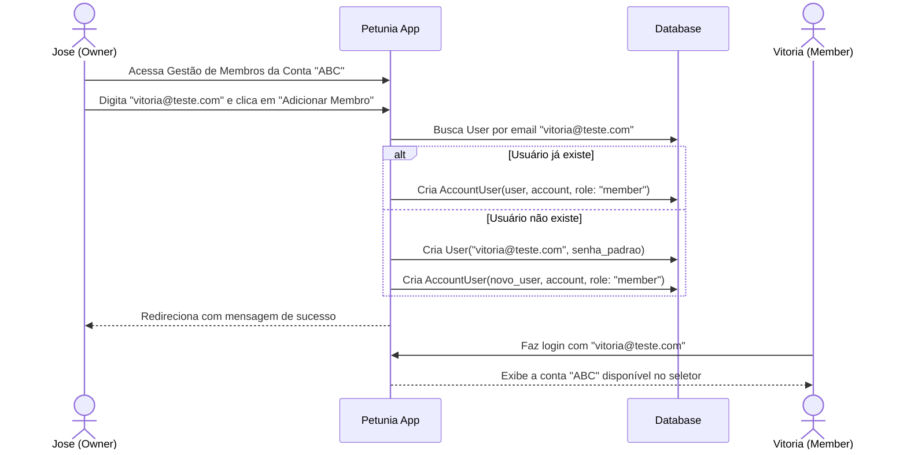

# 📋 Plano de Implementação: Gestão de Membros e Compartilhamento de Ambientes (`AccountUser`)

Este documento descreve o planejamento técnico para permitir que um usuário (ex: `jose@teste.com`) adicione outros usuários (ex: `vitoria@teste.com`) para compartilharem o mesmo ambiente/conta financeira (`Account`).

---

## 🎯 Descrição do Objetivo

Permitir que usuários proprietários de uma `Account` possam:
1. **Adicionar novos membros por e-mail** (ex: `vitoria@teste.com`) atribuindo um papel (`owner` / `member`).
   - Se o usuário informado **já existir** no sistema, ele é associado à conta imediatamente.
   - Se o usuário informado **não existir**, a conta de usuário é criada automaticamente no sistema com uma senha padrão/inicial e vinculada ao ambiente.
2. **Visualizar a lista de membros** da conta ativa com indicação de seus papéis (*Proprietário* / *Membro*).
3. **Remover membros** da conta (garantindo que a conta não fique sem pelo menos 1 proprietário).

---

## ⚠️ User Review Required

> [!IMPORTANT]
> **Criação de Usuário Inexistente**: Quando um e-mail não cadastrado for adicionado a uma conta, o sistema criará a conta do usuário automaticamente com a senha padrão temporária `senha123password` (ou permitindo definir a senha no formulário) para que o novo usuário possa fazer login imediatamente.

> [!NOTE]
> **Controle de Acesso**: Apenas usuários com o papel `owner` (Proprietário) no ambiente ativo poderão adicionar ou remover outros membros.

---

## ❓ Perguntas Abertas

1. Quando o e-mail informado para adição não existir no sistema, você prefere:
   - **Opção A (Recomendada)**: Criar o usuário automaticamente com uma senha inicial padrão (ex: `senha123password`) e avisar no feedback do formulário.
   - **Opção B**: Exigir que o usuário informe explicitamente a senha inicial do novo convidado no formulário.
   - **Opção C**: Exigir que o usuário já esteja previamente cadastrado no Petunia antes de ser adicionado.

---

## 🛠️ Alterações Propostas



---

### Componente 1: Rotas e Controller de Membros (`AccountUsersController`)

#### [NEW] `app/controllers/account_users_controller.rb`
- `before_action :authenticate_user!`
- `before_action :ensure_owner!` (valida se `current_user` tem papel `owner` na `current_account`).
- `index`: exibe os membros da `current_account`.
- `create`:
  - Recebe `email` e `role` (`member` ou `owner`).
  - Procura `User.find_by(email: email.downcase)`.
  - Se não encontrar, cria `User.create!(email: email, password: 'senha123password', password_confirmation: 'senha123password')`.
  - Associa via `AccountUser.create!(user: user, account: current_account, role: role)`.
- `destroy`:
  - Remove o vínculo `AccountUser`. Impede a remoção se for o último `owner` da conta.

#### [MODIFY] `config/routes.rb`
- Adicionar rota aninhada `resources :account_users` dentro de `resources :accounts`:
  ```ruby
  resources :accounts, only: [:index, :new, :create] do
    post :switch, on: :member
    resources :account_users, only: [:index, :create, :destroy], path: 'members'
  end
  ```

---

### Componente 2: Interface do Usuário (Obsidian Dark UI)

#### [NEW] `app/views/account_users/index.html.erb`
- Card de formulário para adicionar membro por e-mail e papel.
- Tabela/Lista estilizada com os membros atuais da conta (e-mail, papel, data de entrada e botão para remover).

#### [MODIFY] `app/views/accounts/index.html.erb`
- Adicionar botão/link "Gerenciar Membros" no card de cada conta pertencente ao usuário.

#### [MODIFY] `app/views/shared/_header.html.erb`
- Adicionar opção no menu de contexto para acessar os membros da conta ativa.

---

### Componente 3: Internacionalização (i18n)

#### [MODIFY] `config/locales/pt-BR.yml` & `config/locales/en.yml`
- Traduções para:
  - `account_users.index.title` ("Membros do Ambiente")
  - `account_users.index.add_member` ("Adicionar Membro")
  - `account_users.create.success_existing` ("Usuário %{email} adicionado à conta.")
  - `account_users.create.success_created` ("Usuário %{email} criado e adicionado à conta com a senha temporária 'senha123password'.")
  - `account_users.destroy.success` ("Membro removido da conta.")
  - `account_users.destroy.last_owner_error` ("Não é possível remover o único proprietário da conta.")

---

## 🧪 Plano de Verificação

### Testes Automatizados (RSpec)
Executar via terminal:
```bash
POSTGRES_HOST=127.0.0.1 bundle exec rspec
```

Novos testes em `spec/requests/account_users_spec.rb`:
1. **Adicionar usuário existente**: `jose@teste.com` adiciona `vitoria@teste.com` à conta "ABC" e confirma que ela ganha acesso.
2. **Adicionar usuário inexistente**: cria a conta do usuário automaticamente e vincula à `Account`.
3. **Impedir duplicação**: tentar adicionar um usuário que já é membro da conta exibe mensagem amigável.
4. **Remoção de membros**: remover um membro funciona; tentar remover o único `owner` é bloqueado.
5. **Permissões**: um usuário com papel `member` não pode adicionar/remover outros membros.

### Verificação Estática (RuboCop)
```bash
bundle exec rubocop app/ config/ spec/
```
