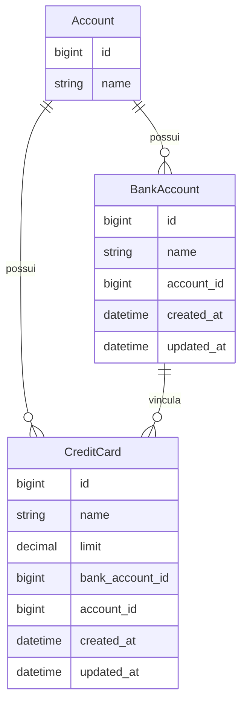

# 📋 Plano de Implementação: FASE 3 — Contas Bancárias e Cartões de Crédito

Este documento descreve o planejamento de engenharia para a **FASE 3** da aplicação **Petunia**. O objetivo principal é introduzir a gestão de **Contas Bancárias (`BankAccount`)** e **Cartões de Crédito (`CreditCard`)**, garantindo o devido isolamento por ambiente ativo (`Account`).

---

## 🎯 Descrição do Objetivo

1. **Gestão de Contas Bancárias (`BankAccount`)**:
   - Cadastro, edição, listagem e exclusão de contas bancárias (ex: *Itaú*, *Nubank*, *Bradesco*).
   - Cada conta bancária pertence obrigatoriamente a uma `Account` (ambiente financeiro ativo).

2. **Gestão de Cartões de Crédito (`CreditCard`)**:
   - Cadastro, edição, listagem e exclusão de cartões de crédito (ex: *Nubank Ultravioleta*, *XP Visa Infinite*).
   - Cada cartão possui um nome, um limite total (`limit: decimal`) e **deve ser vinculado obrigatoriamente a uma conta bancária** existente no mesmo ambiente (`Account`).

3. **Interface e UX no Padrão Obsidian Dark**:
   - Páginas CRUD para gerenciar contas bancárias e cartões com cartões visuais, indicação de limites formatados em Real (`R$`) e navegação acessível a partir do header.

4. **Multi-Tenancy & Segurança**:
   - Garantir que todos os registros criados, editados e listados pertençam estritamente ao `current_account` do usuário ativo.
   - Impedir que um cartão de crédito seja associado a uma conta bancária pertencente a outro ambiente.

5. **Testes RSpec e i18n em Português**:
   - Especificações unitárias de modelo e especificações de requisição cobrindo fluxos felizes e exceções de segurança/multitenancy.

---

## ⚠️ User Review Required

> [!IMPORTANT]
> **Obrigatoriedade do Vínculo de Cartão de Crédito**: Conforme definido no requisito do projeto, **todo cartão de crédito deve ser associado a uma conta bancária existente**. Portanto, o usuário precisará ter ao menos 1 conta bancária cadastrada no ambiente antes de criar um cartão de crédito.

> [!NOTE]
> **Formatação de Moeda**: Os limites de cartão de crédito serão armazenados no banco de dados como `decimal` com 2 casas decimais (ex: `5000.00`) e formatados na interface como moeda brasileira (ex: `R$ 5.000,00`).

---

## ❓ Perguntas Abertas

Não há perguntas impeditivas no momento. Todas as regras derivam diretamente dos requisitos de `.agents/roadmap.md` e `.agents/description.md`.

---

## 🛠️ Alterações Propostas



---

### Componente 1: Banco de Dados & Models

#### [NEW] `db/migrate/TIMESTAMP_create_bank_accounts.rb`
- `name` (string, null: false)
- `account_id` (references, null: false, foreign_key: true)
- Índice de unicidade no par `[account_id, name]`.

#### [NEW] `db/migrate/TIMESTAMP_create_credit_cards.rb`
- `name` (string, null: false)
- `limit` (decimal, precision: 10, scale: 2, default: 0.0, null: false)
- `bank_account_id` (references, null: false, foreign_key: true)
- `account_id` (references, null: false, foreign_key: true)
- Índice de unicidade no par `[account_id, name]`.

#### [NEW] `app/models/bank_account.rb`
- `belongs_to :account`
- `has_many :credit_cards, dependent: :destroy`
- `validates :name, presence: true, uniqueness: { scope: :account_id }`

#### [NEW] `app/models/credit_card.rb`
- `belongs_to :bank_account`
- `belongs_to :account`
- `validates :name, presence: true, uniqueness: { scope: :account_id }`
- `validates :limit, presence: true, numericality: { greater_than_or_equal_to: 0 }`
- `validate :bank_account_belongs_to_same_account` (garante que `bank_account.account_id == account_id`).

#### [MODIFY] `app/models/account.rb`
- `has_many :bank_accounts, dependent: :destroy`
- `has_many :credit_cards, dependent: :destroy`

#### [NEW] `spec/factories/bank_accounts.rb` & `spec/factories/credit_cards.rb`
Factories configuradas para geração dinâmica de dados nos testes.

---

### Componente 2: Controllers e Rotas

#### [NEW] `app/controllers/bank_accounts_controller.rb`
- `before_action :authenticate_user!`
- Actions: `index`, `new`, `create`, `edit`, `update`, `destroy`
- Filtro por `current_account.bank_accounts`.

#### [NEW] `app/controllers/credit_cards_controller.rb`
- `before_action :authenticate_user!`
- Actions: `index`, `new`, `create`, `edit`, `update`, `destroy`
- Filtro por `current_account.credit_cards`.

#### [MODIFY] `config/routes.rb`
- Adicionar recursos:
  ```ruby
  resources :bank_accounts, except: [:show]
  resources :credit_cards, except: [:show]
  ```

---

### Componente 3: Views e Interface Obsidian Dark

#### [MODIFY] `app/views/shared/_header.html.erb`
- Adicionar links no menu da aplicação para:
  - "Contas Bancárias" (`bank_accounts_path`)
  - "Cartões de Crédito" (`credit_cards_path`)

#### [NEW] `app/views/bank_accounts/index.html.erb` & `new.html.erb` & `edit.html.erb`
- Tela de listagem de contas bancárias em formato de cards Obsidian Dark com botões de editar/excluir.
- Formulários limpos para criação/edição.

#### [NEW] `app/views/credit_cards/index.html.erb` & `new.html.erb` & `edit.html.erb`
- Tela de listagem dos cartões de crédito com destaque para o limite total (`R$ X.XXX,XX`) e o nome da conta bancária vinculada.
- Formulário dinâmico permitindo selecionar apenas contas bancárias do ambiente atual.

---

### Componente 4: Internacionalização (i18n)

#### [MODIFY] `config/locales/pt-BR.yml` & `config/locales/en.yml`
- Traduções completas para:
  - `activerecord.models.bank_account` ("Conta Bancária")
  - `activerecord.models.credit_card` ("Cartão de Crédito")
  - Attributes (`name`, `limit`, `bank_account`).
  - Títulos de páginas, botões, legendas e mensagens flash.

---

## 🧪 Plano de Verificação

### Testes Automatizados (RSpec)
Executar suíte de testes:
```bash
POSTGRES_HOST=127.0.0.1 bundle exec rspec
```

Casos a serem validados:
1. `spec/models/bank_account_spec.rb`: validações de nome, unicidade por conta e deleção em cascata dos cartões vinculados.
2. `spec/models/credit_card_spec.rb`: validações de limite numérico, obrigatoriedade de conta bancária e trava para contas bancárias de outros ambientes.
3. `spec/requests/bank_accounts_spec.rb`: CRUD completo e isolamento multi-tenant.
4. `spec/requests/credit_cards_spec.rb`: CRUD completo, validação de criação sem contas bancárias e isolamento multi-tenant.

### Análise Estática (RuboCop)
```bash
bundle exec rubocop app/ config/ spec/ db/
```

### Verificação Manual
1. Acessar o sistema, navegar até "Contas Bancárias" e criar uma conta (ex: *Nubank*).
2. Navegar até "Cartões de Crédito" e cadastrar um cartão (ex: *Nubank Ultravioleta*) vinculando à conta recém-criada com limite de `R$ 10.000,00`.
3. Alternar de ambiente e verificar que os cartões e contas da outra conta não são visíveis.
